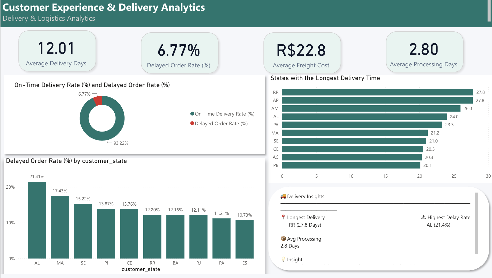

# E-Commerce Business Intelligence Dashboard — End-to-End Analytics Project


## Project Overview

This project is an end-to-end e-commerce analytics and business intelligence solution designed to transform raw operational data into meaningful insights and interactive business reporting.

The project combines **Python-based data preparation** with **Power BI dashboard development**. Raw datasets covering orders, customers, products, payments, reviews, sellers, delivery activity, and geographic information were inspected, cleaned, validated, and transformed before being modeled in Power BI.

The final solution provides decision-makers with clear visibility into revenue performance, customer behavior, product categories, delivery efficiency, freight costs, satisfaction levels, and geographic patterns.

---

## Analytics Workflow

```text
Raw E-Commerce Data
        ↓
Data Inspection
        ↓
Python Data Cleaning
        ↓
Data Validation & Transformation
        ↓
Exploratory Data Analysis
        ↓
Cleaned Datasets
        ↓
Power BI Data Modeling
        ↓
DAX Measures & KPIs
        ↓
Interactive Dashboards
        ↓
Business Insights
```

---

## Tools Used

* Python
* Pandas
* NumPy
* Matplotlib
* Jupyter Notebook
* Power BI
* Power Query
* DAX
* Data Modeling
* Dimensional Modeling
* Star Schema
* Data Cleaning
* Data Validation
* Data Transformation
* Exploratory Data Analysis
* Data Visualization
* KPI Reporting

---

## Dataset

The project uses multiple relational e-commerce datasets representing different parts of the customer and order lifecycle.

The main datasets include:

* Orders
* Order Items
* Customers
* Products
* Payments
* Reviews
* Sellers
* Geolocation

These datasets were prepared individually and then connected through a structured analytical model in Power BI.

---

## Python Data Preparation

Python was used before loading the data into Power BI to improve data quality and ensure that the final analysis was based on reliable and consistent information.

### Pandas

Used for:

* Loading and inspecting datasets
* Reviewing columns and data types
* Detecting duplicate records
* Handling missing values
* Cleaning categorical data
* Converting date columns
* Validating numerical fields
* Transforming datasets
* Exporting cleaned files for Power BI

### NumPy

Used for:

* Numerical operations
* Conditional data transformations
* Handling analytical values
* Supporting data validation

### Matplotlib

Used for:

* Exploratory data analysis
* Distribution analysis
* Trend visualization
* Detecting patterns and unusual observations
* Understanding the data before dashboard development

---

## Data Cleaning & Transformation

The data preparation process included:

* Checking dataset structure and data types
* Converting date fields into appropriate formats
* Detecting and handling missing values
* Checking duplicate records
* Standardizing inconsistent categorical values
* Validating numerical fields
* Identifying unusual or invalid records
* Preparing cleaned datasets for reporting
* Exporting final datasets for Power BI

---

## Data Modeling

The cleaned datasets were imported into Power BI and organized into a structured analytical model.

The model was designed around a central transactional fact table supported by related dimensions.

### Main Fact Table

* Fact Order Items

### Supporting Dimensions

* Customers
* Products
* Payments
* Reviews
* Geolocation
* Date

This structure supports efficient filtering, aggregation, KPI calculations, and interactive analysis across multiple business dimensions.

---

## Power BI Development

Power BI was used to transform the cleaned datasets into an interactive business intelligence solution.

The development process included:

* Data modeling
* Table relationships
* Date table creation
* DAX measures
* KPI development
* Power Query transformations
* Interactive slicers
* Customer analysis
* Product analysis
* Delivery analysis
* Geographic analysis
* Trend analysis
* Dashboard navigation
* Business storytelling

---

## Key KPIs & Measures

The dashboard includes measures covering revenue, customers, products, and operational performance.

Examples include:

* Total Revenue
* Total Orders
* Average Revenue per Order
* Average Revenue per Customer
* Average Ticket
* Delayed Orders
* Delayed Order Rate
* On-Time Delivery Rate
* Freight Cost
* Customer Satisfaction
* Product Category Performance
* Top Categories
* Bottom Categories

---

## Business Questions Answered

* What is the overall e-commerce performance?
* How is revenue trending over time?
* Which product categories generate the most revenue?
* Which categories are underperforming?
* Which customers contribute the most revenue?
* How does customer behavior vary across segments and locations?
* What percentage of orders are delivered on time?
* Which customers or regions experience the highest delivery delays?
* How much is being spent on freight?
* How does delivery performance affect customer satisfaction?
* Which geographic areas generate stronger business activity?
* Where are the main opportunities for operational improvement?

---

## Dashboard Pages

### 1. Executive Overview

Provides a high-level view of overall business performance through key KPIs, revenue trends, customer activity, and operational indicators.

The page is designed to give decision-makers a quick understanding of overall e-commerce performance.


---

### 2. Product & Customer Performance

Analyzes product categories and customer behavior to identify the strongest contributors to business performance.

The page includes analysis of:

* Product category performance
* Revenue contribution
* Top and bottom categories
* Customer activity
* Customer revenue
* Customer satisfaction
* Product and customer trends


---

### 3. Delivery Performance

Focuses on logistics and operational performance across the order delivery process.

The page includes analysis of:

* Average delivery time
* Delayed order rate
* On-time delivery rate
* Delivery performance by customer
* Delivery performance by location
* Freight costs
* Processing time
* Operational delay patterns



---

### 4. Power BI Data Model

The data model connects the cleaned e-commerce datasets through structured relationships to support cross-table analysis and DAX calculations.

The model demonstrates:

* Fact and dimension table design
* Table relationships
* Dimensional modeling
* Date-based analysis
* Cross-filtering
* Structured business intelligence modeling


---

## Key Analytical Areas

### Revenue Analysis

* Overall revenue performance
* Revenue trends
* Revenue by product category
* Revenue by customer
* Geographic revenue patterns

### Product Analysis

* Category performance
* Top-performing categories
* Bottom-performing categories
* Product contribution
* Revenue concentration

### Customer Analysis

* Customer purchasing behavior
* Revenue per customer
* Customer satisfaction
* Geographic customer patterns
* Customer performance

### Delivery & Logistics Analysis

* Delivery times
* Delayed orders
* On-time delivery performance
* Processing time
* Freight costs
* Geographic delivery patterns

---

## Key Features

* End-to-end analytics workflow
* Multi-table relational dataset
* Python-based data preparation
* Data cleaning and validation
* Exploratory data analysis
* Power BI data modeling
* Star-schema principles
* DAX measures
* KPI reporting
* Interactive slicers
* Revenue analysis
* Product analysis
* Customer analytics
* Delivery and logistics analysis
* Geographic analysis
* Trend analysis
* Business-focused dashboard design

---

## Skills Demonstrated

* Data Analysis
* Business Intelligence
* Python
* Pandas
* NumPy
* Matplotlib
* Exploratory Data Analysis
* Data Cleaning
* Data Validation
* Data Transformation
* ETL
* Power BI
* Power Query
* DAX
* Data Modeling
* Dimensional Modeling
* Star Schema
* KPI Development
* Dashboard Development
* Data Visualization
* Customer Analysis
* Product Analysis
* Operational Analysis
* Delivery Analysis
* Trend Analysis
* Business Storytelling
* Analytical Thinking
* Insight Generation

---

## Repository Structure

```text
E-Commerce-Business-Intelligence-Dashboard/
│
├── README.md
│
├── notebooks/
│   └── ecommerce-data-cleaning-analysis.ipynb
│
├── data/
│   ├── raw/
│   └── cleaned/
│
├── power-bi/
│   └── ecommerce-business-intelligence-dashboard.pbix
│
└── images/
    ├── executive-overview.png
    ├── product-customer-performance.png
    ├── delivery-performance.png
    └── powerbi-data-model.png
```

---

## Files Included

* `README.md` — Complete project documentation
* `notebooks/` — Python data cleaning and exploratory analysis
* `data/raw/` — Original datasets before cleaning
* `data/cleaned/` — Cleaned and transformed datasets
* `power-bi/` — Power BI report file
* `images/` — Dashboard and data model screenshots

---

## Project Value

This project demonstrates the ability to manage the complete analytics lifecycle — from raw multi-table data to a structured and interactive business intelligence solution.

By combining Python-based data preparation with Power BI data modeling, DAX calculations, and dashboard development, the project turns complex e-commerce data into clear insights across revenue, customers, products, delivery performance, and business operations.

The project demonstrates not only dashboard development, but also the underlying analytical work required to build reliable and decision-focused reporting.

---

## Author

**Anas Alfuraydi**

* Portfolio: [anasalfuraydi.github.io](https://anasalfuraydi.github.io/)
* LinkedIn: [Anas Adnan](https://www.linkedin.com/in/anas-adnan/)
* GitHub: [AnasAlfuraydi](https://github.com/AnasAlfuraydi)
